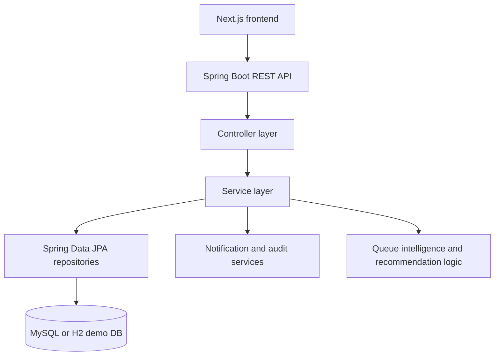

Vercel deployment link : https://frontend-peach-sigma-ppreby0q9s.vercel.app

Local frontend: http://localhost:3000

Local Spring Boot backend: http://localhost:8080


# Farmer Procurement Scheduling and Queue Management System

Production-oriented SIH 2026 prototype for PS ID `SIH26032`.

## What is included

- Next.js farmer/admin frontend in `frontend/`
- Spring Boot REST API in `backend/`
- MySQL-compatible schema in `database/schema.sql`
- Demo seed data loaded automatically on backend startup when `DEMO_SEED=true`
- JWT authentication, role checks, farmer ownership checks, slot booking, centre/day tokens, live queue polling, ETA, procurement status, payment status, notifications, audit logs, and admin analytics

## Architecture



Spring Boot is the authoritative backend. The old in-memory Next.js API handlers have been removed so the frontend consistently calls `NEXT_PUBLIC_API_BASE`.

## Demo credentials

- Farmer: `9876501001` / `farmer123`
- Farmer ID login also works: `FARM1001` / `farmer123`
- Admin: `admin` / `admin123`

## Run backend

```bash
cd backend
mvn spring-boot:run
```

By default the backend uses in-memory H2 so the prototype runs immediately.

For MySQL:

```bash
export DB_URL='jdbc:mysql://localhost:3306/procurement_db'
export DB_USERNAME='root'
export DB_PASSWORD='your_password'
export DB_DRIVER='com.mysql.cj.jdbc.Driver'
export JWT_SECRET='replace-with-a-long-random-secret'
export BUSINESS_TIMEZONE='Asia/Kolkata'
mvn spring-boot:run
```

Create the database first:

```sql
CREATE DATABASE procurement_db;
```

## Run frontend

```bash
cd frontend
npm install
cp .env.example .env.local
npm run dev
```

Open `http://localhost:3000`.

## Main API endpoints

- `POST /api/auth/register`
- `POST /api/auth/login`
- `GET /api/centres`
- `GET /api/crops`
- `GET /api/slots/available?centreId=1&date=<today>`
- `POST /api/slots/book`
- `GET /api/bookings/my`
- `PUT /api/bookings/{id}/cancel`
- `PUT /api/bookings/{id}/reschedule`
- `GET /api/farmers/{farmerId}/bookings`
- `GET /api/queue/{bookingId}`
- `GET /api/admin/queue?centreId=1`
- `PUT /api/queue/next?centreId=1`
- `PUT /api/officer/bookings/{id}/arrive`
- `PUT /api/officer/bookings/{id}/verification`
- `PUT /api/officer/bookings/{id}/procurement`
- `PUT /api/officer/bookings/{id}/complete`
- `PUT /api/procurements/{id}/status`
- `PUT /api/payments/{id}/status`
- `GET /api/notifications/{userId}`
- `GET /api/admin/dashboard?centreId=1`
- `GET /api/admin/audit`

## Queue intelligence

ETA is no longer `people ahead * 5 minutes`. The backend estimates wait using active farmers ahead for the selected centre and business date, recent actual service durations from procurement timestamps, active counter count, and a congestion factor from current queue load versus centre capacity.

The booking and slot responses include estimated wait minutes, congestion level, average service time, active counters, and a confidence label. This is a statistical/rule-based prototype, not a claimed ML model.

## Security

- Passwords are hashed with BCrypt.
- Login/register issue signed JWT access tokens.
- Farmer endpoints enforce owner access.
- Officer/admin endpoints require `OFFICER` or `ADMIN`.
- Status changes go through a backend state machine.
- Critical changes create audit records.
- Secrets and CORS origins are environment-configured.

## Database changes

The domain now includes booking business dates, token sequences, procurement timestamps, weighed/accepted quantities, payment metadata, notifications with type, counters, audit logs, and a database-backed `booking_token_sequence` table for centre/day token numbering.

## Testing

Frontend:

```bash
cd frontend
npm run build
```

Backend:

```bash
cd backend
mvn test
```

Focused backend tests cover JWT parsing/rejection and valid procurement state-machine behavior.

## SIH demo flow

1. Open the landing page and explain the problem: long waits and low visibility at procurement centres.
2. Login as farmer `9876501001`.
3. Open the farmer dashboard to show token, queue position, timeline, and notifications.
4. Book a new slot with another registered or newly created farmer.
5. Login as admin.
6. Click `Call Next Farmer` to move the live queue.
7. Move a token through `Arrived`, `Verify`, `Procure`, and `Complete`.
8. Mark payment as `Paid`.
9. Return to farmer dashboard and show updated status, amount, payment badge, and notifications.

## Limitations

- Real-time delivery is still implemented as frontend polling; Spring WebSocket is not yet added.
- SMS/push channels are represented by in-app notifications only.
- Map, voice, Hindi i18n, PWA offline sync, and external payment integrations remain future phases.
- Demo seed data is isolated behind `DEMO_SEED`; dashboard metrics are database-derived, not hardcoded.
